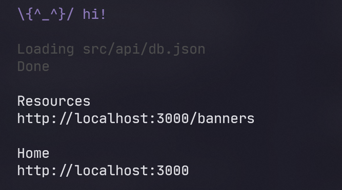
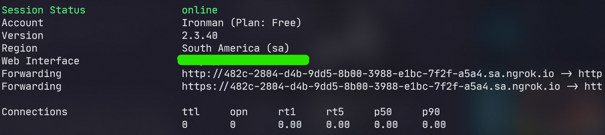

# Welcome to Prime Video App Clone

To install dependencies run your terminal:

```bash
yarn
```

This project use .env file to get base_url to fetch data, so you will be install ngrok on your PC. Follow this link: https://ngrok.com/download

To serve data like a fake api, will be necessary the json-server package. Install:

```bash
yarn global add json-server
```

Init server (check if you be in the root of this project):

```bash
json-server src/api/db.json 3000
```

Your terminal shoud be like:


Observe the port of your server (3000)

After, run your terminal :

```bash
ngrok http -region=sa 3000
```

Your terminal shoud be like:



Copy the https link, and add a `.env` file (root project)

```javascript
// .env
API_BASE_URL = 'ngrok-https-link';
```

Finish, start project:

```bash
yarn android
```
